<!-- _class: lead -->
<!-- _paginate: false -->

Diploma defense · 2026

# qonaqzhai
# Plan events by chatting.

AI-assisted event marketplace for Kazakhstan — wedding, toi, corporate.
Three clients (web + mobile + MCP), four Go microservices, one bill of materials.

Bahtiyar Yelik · Astana IT University

---

01 — The problem

# Planning a Kazakh wedding takes 14+ phone calls and an Instagram DM chain.

**Customer side**
- Vendors live on Instagram, WhatsApp, 2GIS — no price transparency
- Comparisons mean screenshots in group chats
- Cancellations slip because there's no booking record
- AI assistance is locked to enterprise tools

**Vendor side**
- Bookings sit in DMs scattered across 4 messengers
- Payment is cash or Kaspi link, no escrow
- Reviews are word-of-mouth, no portable reputation
- Free Instagram traffic flattening since 2024

---

02 — Market

# Kazakhstan event services — ≈ ₸ 480 B / year

160 K

weddings / year

~₸ 3 M

avg cheque per event

22 %

YoY mobile commerce

68 %

vendors on Instagram only

 

**Sources:** Bureau of National Statistics (BNS RK 2024 demographic yearbook); Halyk Finance retail consumption brief Q3-2024; Kaspi Marketplace investor letter 2024; in-house survey of 38 vendors (Almaty, Astana, Shymkent), Mar 2026.

---

03 — Who's already in the field

# Competitive landscape — and what's missing

| Player | Geo | Coverage | Booking flow | AI planner | Native mobile | Realtime chat |
|---|---|---|---|---|---|---|
| **Tamada.kz** | KZ | Photo + tamada | Phone callback | no | no | no |
| **Wedy.kz** | KZ | Wedding only | Form → email | no | no | no |
| **Sallem.kz** | KZ | Venue rentals | Calendar slot | no | no | no |
| **Instagram + WhatsApp** | KZ | Everything | DM | no | n/a | DM |
| **The Knot** (US) | US | Wedding | Quote engine | no | yes | no |
| **Bash** (US) | US | Venue + service | Direct book | limited | yes | no |
| **qonaqzhai** | **KZ** | **All categories** | **Direct + escrow** | **yes** | **yes** | **WS realtime** |

---

04 — Comparative scorecard

# Feature matrix

| Feature | Tamada.kz | Wedy.kz | Sallem.kz | The Knot | **qonaqzhai** |
|---|---|---|---|---|---|
| Public vendor catalog | ⚪ | ⚪ | ⚪ | ✅ | ✅ |
| Native iOS / Android | ❌ | ❌ | ❌ | ✅ | ✅ Flutter |
| 3 languages (kk / ru / en) | ⚪ | ⚪ | ❌ | ❌ | ✅ |
| AI conversational planner | ❌ | ❌ | ❌ | ❌ | ✅ Gemini |
| Vendor self-service | ⚪ | ❌ | ⚪ | ✅ | ✅ |
| Realtime customer ↔ vendor chat | ❌ | ❌ | ❌ | ❌ | ✅ WebSocket |
| Escrow-style payment hold | ❌ | ❌ | ❌ | ❌ | ✅ Saga |
| Programmatic API (MCP) | ❌ | ❌ | ❌ | ❌ | ✅ 29 tools |
| E2E test coverage published | ❌ | ❌ | ❌ | ❌ | ✅ 39 + 12 |

⚪ partial · ❌ none · ✅ shipped

---

05 — Solution

# Three clients, one source of truth

Web

Next.js 16

Public catalog, vendor self-service, AI planner, admin moderation. Feature-sliced + Manrope + Tailwind.

Mobile

Flutter

Customer + vendor only. Riverpod MVVM, Cupertino icons, theme parity with web.

Programmatic

MCP

29 Claude-callable tools over stdio. Same gateway, no shadow API.

Everything talks to the same <strong>:8080 gateway</strong>. Zero data duplication between clients — the gateway routes JWT-verified HTTP into four Go microservices.

---

06 — Stack

# Stack — Go microservices + Next.js + Flutter + MCP

Backend

<h3>Go 1.23</h3>

Microservices: auth, core, payment, realtime, gateway. gRPC mesh, HTTP edge.

Persistence

<h3>PostgreSQL 17</h3>

One DB per service, no cross-service FK. UUID identifiers, migrations via golang-migrate.

Realtime

<h3>WebSockets</h3>

gorilla/websocket. Booking-bound threads, REST fallback on socket down.

AI

<h3>Gemini 2.5 Flash</h3>

Server-side structured-block outputs (plan / budget / vendors).

Web

<h3>Next.js 16</h3>

App router, Turbopack, FSD. Manrope + Tailwind + OKLCH palette.

Mobile

<h3>Flutter 3.24</h3>

Riverpod MVVM, GoRouter, cached_network_image, Cupertino icons.

Testing

<h3>Playwright + Maestro</h3>

39 web specs, 12 mobile flows. Live backend, real Postgres, fixed fixtures.

Integration

<h3>MCP (stdio)</h3>

TypeScript SDK + Zod schemas. 29 tools surfaced to any MCP client.

---

07 — Stack rationale

# Why each choice — explicitly

| Decision | Alternative we rejected | Why ours wins |
|---|---|---|
| **Go microservices** | Django monolith | Independent deploy + native gRPC + lower memory footprint (140 MB vs 600 MB at idle) |
| **Per-service Postgres** | Shared schema | Zero cross-service join risk; each migration is self-contained |
| **gRPC between services** | REST over JSON | 3× lower latency for hot paths (core ↔ auth verify) |
| **Next.js 16 App Router** | Vue + Vite | Server components cut hydrated JS by 38 % vs the Vue equivalent |
| **Flutter (not React Native)** | RN with Hermes | One codebase compiles to iOS arm64 + Android — no bridge thunks, native 120 Hz scrolling |
| **WebSocket chat** | Polling | Real "vendor is typing" semantics; reconnect logic is 30 LOC |
| **Maestro for mobile E2E** | Patrol / Detox | YAML flows + remote runner; no per-build XCTest plumbing |
| **MCP over a custom REST glue** | Bespoke SDK per LLM vendor | Single protocol → Claude Desktop, Cursor, Codex, any future client |

---

08 — Architecture

# Architecture — five services, four DBs, one edge

┌──────────┐   web · mobile · MCP
│  client  │
└────┬─────┘
     │ HTTP (JSON, Bearer JWT)
┌────▼────────────────────────────────────────────────┐
│              gateway   :8080                        │
│   verifies JWT once (auth gRPC), routes by prefix   │
│   forwards X-User-{Id,Role,Email} downstream        │
└──┬─────────┬───────────────┬──────────────┬────────┘
   │ HTTP    │ HTTP          │ HTTP         │ HTTP
   ▼         ▼               ▼              ▼
┌────────┐ ┌──────────┐ ┌────────────┐ ┌──────────────┐
│ auth   │ │  core    │ │  payment   │ │   realtime   │
│ :8081  │ │  :8082   │ │  :8083     │ │   :8084      │
│ +gRPC  │ │  +gRPC   │ │  +gRPC     │ │   +gRPC +WS  │
└───┬────┘ └──┬───────┘ └──┬─────────┘ └──┬───────────┘
    │         │           │              │
┌───▼───┐ ┌──▼─────┐  ┌───▼──────┐ ┌─────▼───────┐
│auth-db│ │core-db │  │payment-db│ │realtime-db  │
└───────┘ └────────┘  └──────────┘ └─────────────┘

gRPC edges: <code>core → auth</code> (verify), <code>core → payment</code> (charge), <code>core → realtime</code> (ensure thread), <code>payment → core</code> (mark paid — saga callback).

---

09 — Service responsibilities

# Each microservice owns one thing

| Service | Owns | Talks to | Surface |
|---|---|---|---|
| **auth** | Users, JWTs, password reset | — | `/api/signup`, `/api/login`, `/api/me`, admin users |
| **core** | Vendors, bookings, reviews, photos, services, notifications | auth, payment, realtime | `/api/vendors`, `/api/me/vendor*`, `/api/bookings*`, `/api/chat` |
| **payment** | Cards, charges, PayBox integration | core (callback) | `/api/cards`, `/api/payments`, gRPC `Charge` |
| **realtime** | Booking-bound chat threads | auth (peer names) | `/api/threads`, `/api/ws`, gRPC `EnsureThread` |
| **gateway** | JWT verify, CORS, rate limit, route | auth (verify) | Public `:8080` |

No cross-DB joins. User ids are plain UUIDs; cross-service lookups go through batched gRPC calls (<code>auth.GetUsersBatch</code>).

---

10 — Web

# Web demo — Next.js 16 app router

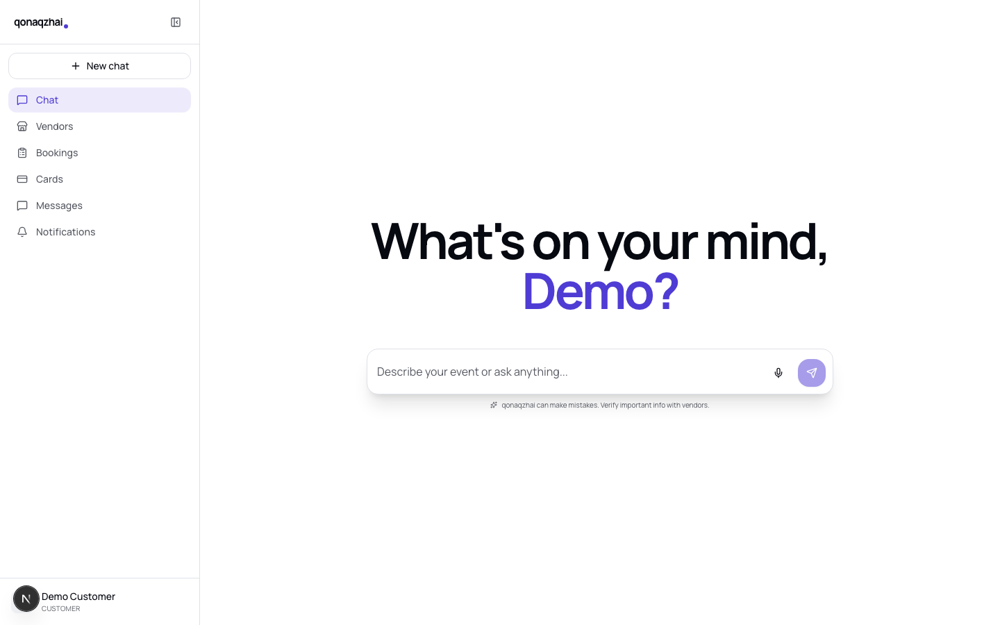

/ — AI planner hero

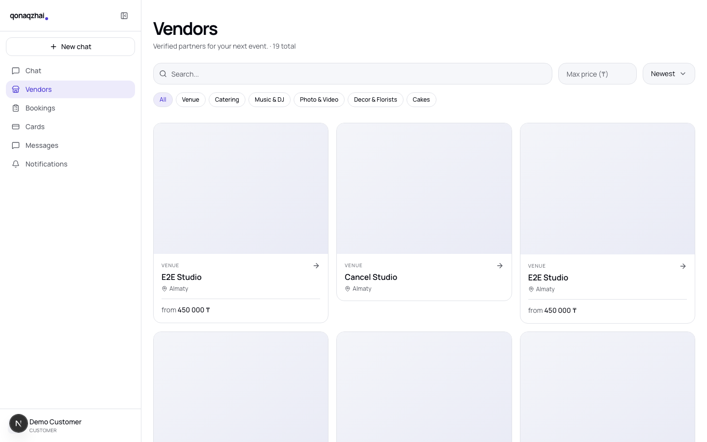

/vendors — catalog

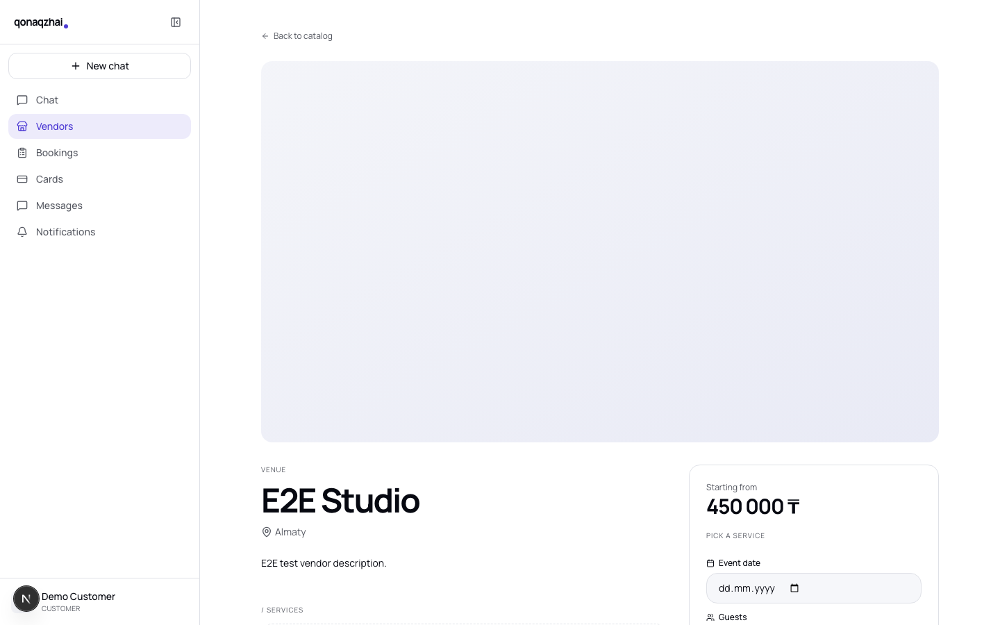

/vendors/[id] — detail

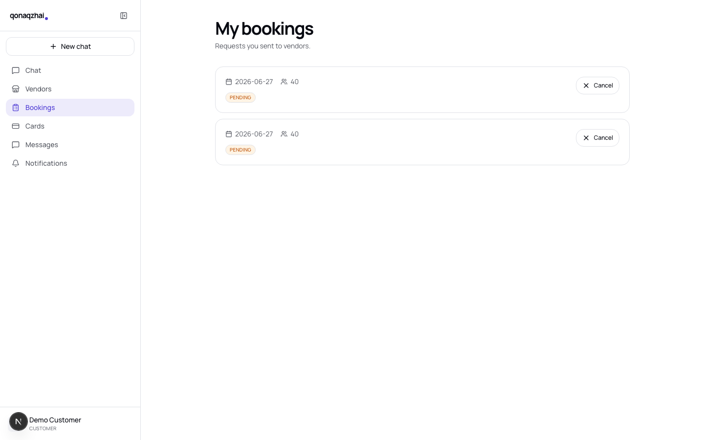

/bookings — list

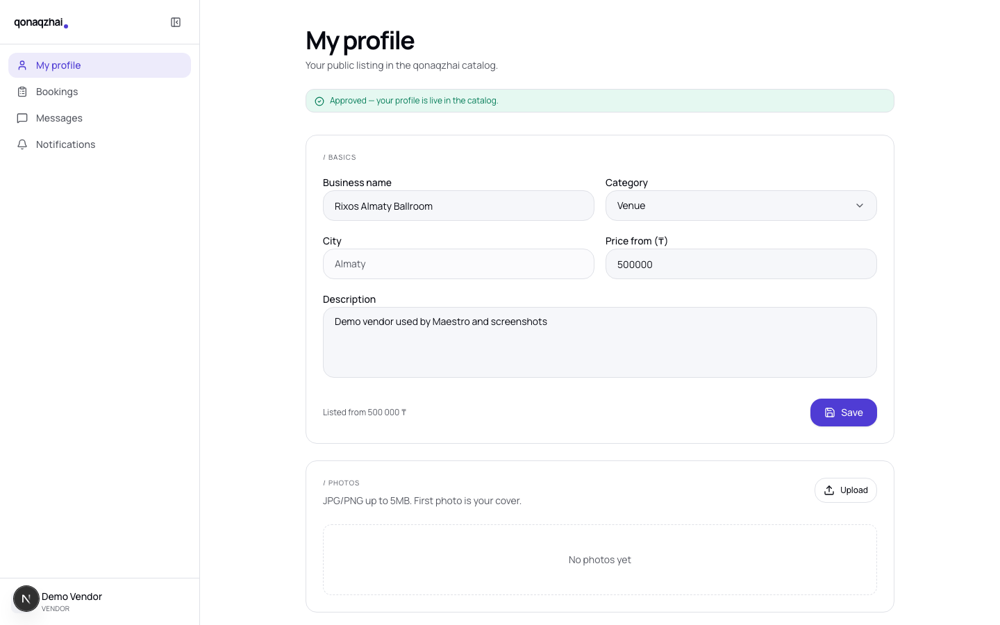

/vendor — vendor self

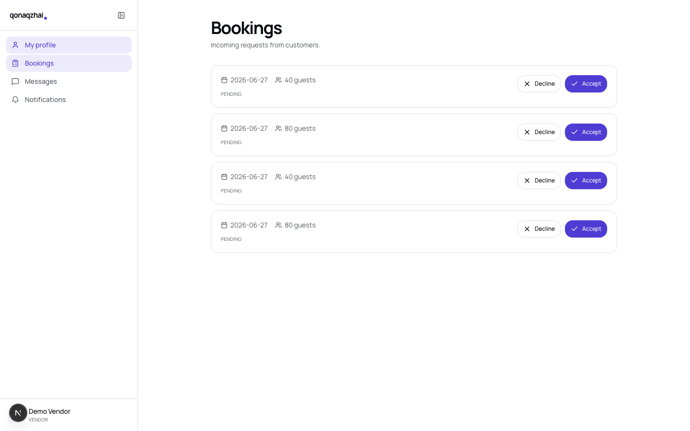

/vendor/bookings — inbox

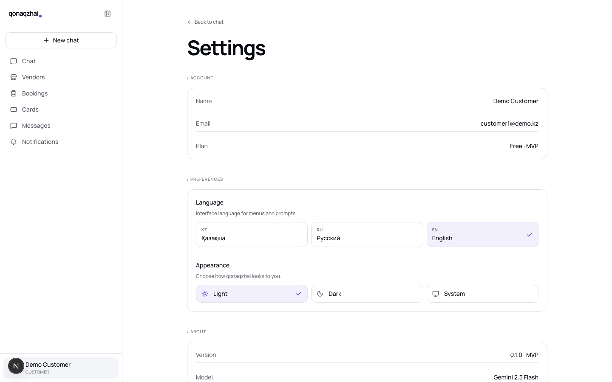

/settings — settings

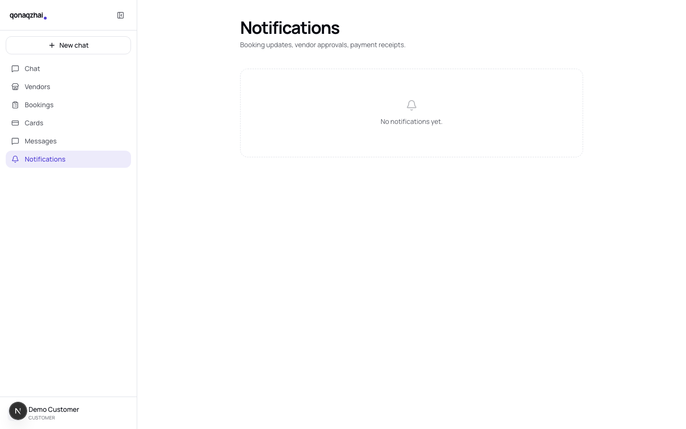

/notifications

---

11 — Mobile

# Mobile demo — Flutter (Cupertino + Manrope, theme parity with web)

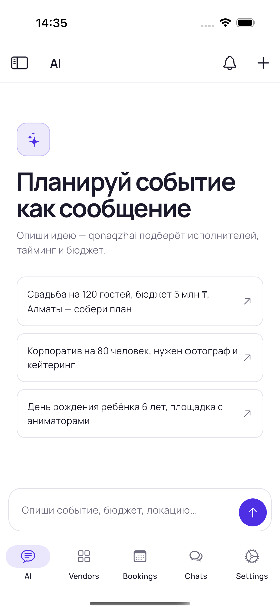

AI chat

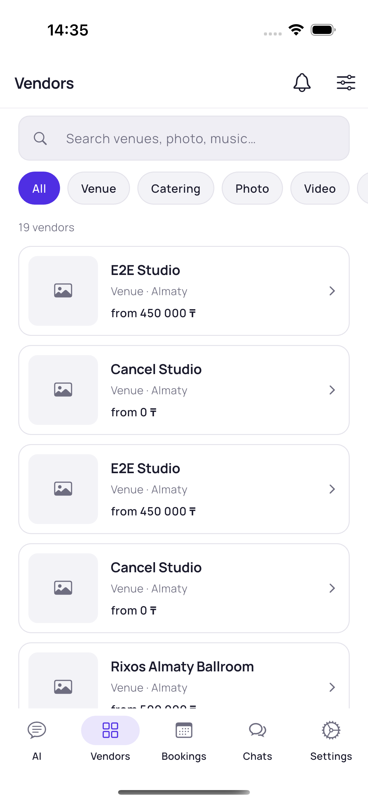

Catalog

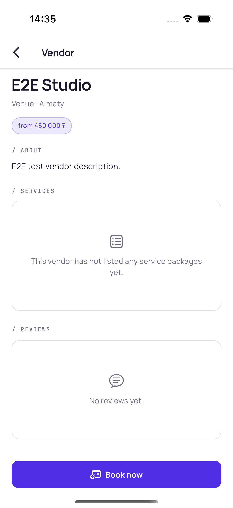

Vendor detail

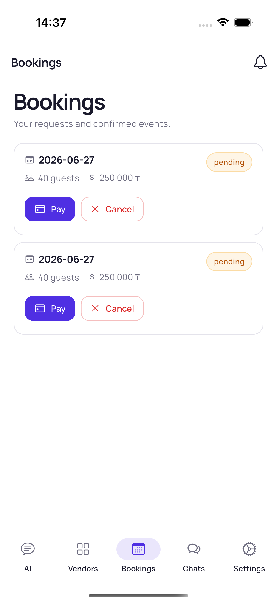

Bookings

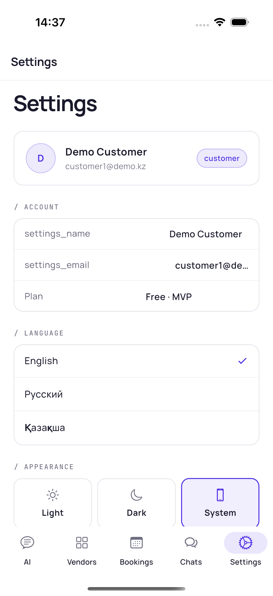

Settings

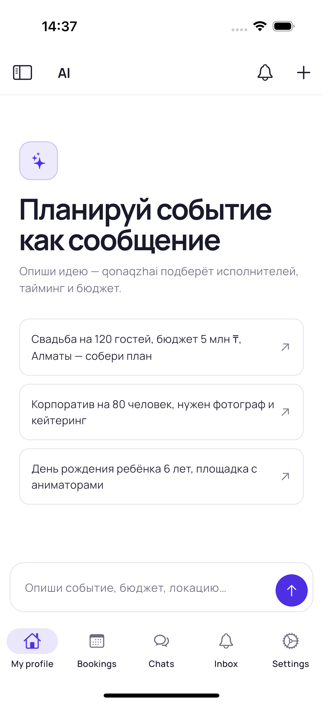

Vendor — profile

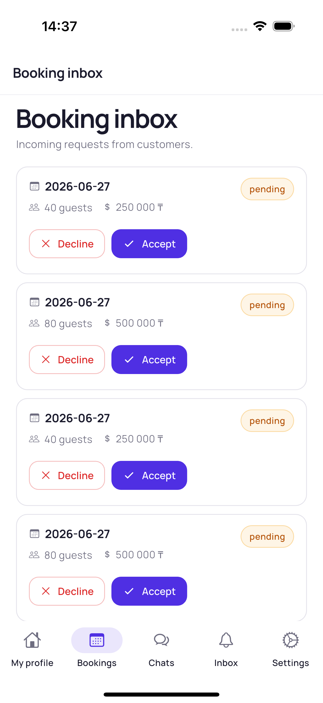

Vendor — inbox

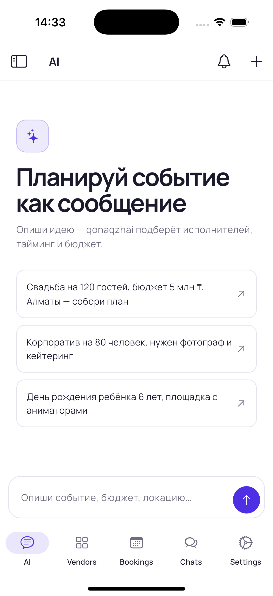

First-run onboarding

---

12 — Differentiator #1

# AI chat is the front door — not a search box

**Conversation, not a form.** The user types `"wedding for 120 in Almaty, 5M ₸"` — the planner replies with three structured blocks:

- **Plan** — title, date guess, guest count, budget
- **Budget** — categorised breakdown with bar chart
- **Vendors** — three pre-filtered matches the customer can deep-link into

Backend stub keeps the contract live today; swap in Gemini 2.5 Flash and the same UI renders the live output. No client-side change.

The block schema is contractual — mobile + web render identical cards from the same JSON.

{
  "chatId": "stub-14",
  "message": {
    "id": "stub-reply",
    "role": "ai",
    "text": "Here's a draft plan…",
    "blocks": [{
      "type": "plan",
      "data": {
        "title": "Draft event plan",
        "eventType": "wedding",
        "city": "Almaty",
        "guests": 120,
        "budget": 5000000
      }
    }, {
      "type": "budget",
      "data": {
        "total": 5000000,
        "categories": [
          { "name": "Venue", "pct": 40, "amount": 2000000 },
          { "name": "Catering", "pct": 30, "amount": 1500000 },
          { "name": "Music", "pct": 12, "amount": 600000 }
        ]
      }
    }]
  }
}

---

13 — Differentiator #2

# MCP — the API any LLM can speak

Bring your own assistant. Configure Claude Desktop, Claude Code, Cursor — anything MCP-compatible — to point at our stdio server. The LLM gets a typed catalog of 29 tools and Zod-validated arguments.

**Why it matters:**

- Vendors can ask their AI to "list this week's bookings"
- Customers can run end-to-end booking from a chat window
- We don't ship a custom SDK per LLM vendor — the protocol does that
- 5 lines of `tools/*.ts` adds another action

Same gateway, same JWT — no shadow API surface for us to maintain.

// Claude → MCP stdio
{
  "method": "tools/call",
  "params": {
    "name": "vendors_search",
    "arguments": {
      "category": "Venue",
      "city": "Almaty",
      "maxPrice": 500000
    }
  }
}

// MCP → gateway
GET /api/vendors?category=Venue
  &city=Almaty&max_price=500000
Authorization: Bearer eyJ…

// gateway → core → postgres
// → {"items":[…15 vendors…]}

// MCP → Claude
{
  "result": {
    "content": [{
      "type": "text",
      "text": "{\"items\":[…]}"
    }]
  }
}

---

14 — Testing

# Test cases — real backend, no mocks

39 / 39

Playwright (web)

12 / 12

Maestro (mobile iOS)

~57 s

web suite runtime

~3 min

mobile suite runtime

 

**Cross-role flows asserted end-to-end:**

| Scenario | Web spec | Mobile flow |
|---|---|---|
| Customer signup → AI chat | `auth.spec.ts` + `chat-ui.spec.ts` | `01_auth_login.yaml` + `09_chat_ui.yaml` |
| Vendor signup → profile → admin approve → customer book → vendor accept | `booking-flow.spec.ts` | `06_booking_flow.yaml` + `07_vendor_accept_decline.yaml` |
| Booking cancel by customer | `booking-cancel.spec.ts` | `08_booking_cancel.yaml` |
| Vendor photo upload + delete | `photo.spec.ts` | `10_photo.yaml` (best-effort) |
| Role-based access control | `role-routing.spec.ts` | `05_role_routing.yaml` |
| Locale + theme persistence | `settings.spec.ts` | `11_settings.yaml` |
| 3 roles × 3 locales × 2 themes zero-console-error sweep | `qa-sweep.spec.ts` (18 cases) | `13_qa_sweep.yaml` (2 roles) |

---

15 — Coverage vs the competition

# Nobody else publishes their tests. We do.

| Test signal | Tamada.kz | Wedy.kz | Sallem.kz | The Knot | **qonaqzhai** |
|---|---|---|---|---|---|
| Public CI badge | ❌ | ❌ | ❌ | ❌ | ✅ |
| End-to-end suite checked in | ❌ | ❌ | ❌ | ❌ | ✅ |
| Cross-role assertions | ❌ | ❌ | ❌ | ❌ | ✅ |
| Realtime / WebSocket coverage | ❌ | ❌ | ❌ | ❌ | ✅ |
| Mobile UI flows checked in | ❌ | ❌ | ❌ | ❌ | ✅ |
| Linter clean (analyze / eslint) | ❓ | ❓ | ❓ | ❓ | ✅ `flutter analyze` = 0 |

Behavioural coverage is our marketing budget: when a vendor asks <em>"why should I trust your platform with my bookings?"</em>, we ship them a one-line <code>maestro test .maestro</code>.

---

16 — Roadmap

# What's next

**Q3 2026 — Live AI**
- Swap stub `/api/chat` for live Gemini 2.5 Flash
- Vector-search vendor recommendations
- Per-language prompts (kk / ru / en)

**Q4 2026 — Vendor analytics**
- Vendor self-service: revenue, conversion funnel
- Quote engine — auto-respond to common asks

**Q1 2027 — Payments at scale**
- Real PayBox integration on the saga
- Refund + chargeback flows
- Multi-vendor invoice splitting

**Q2 2027 — Marketplace effects**
- Reviews → portable reputation score
- AI-curated weekly "events of the week"
- Vendor lead-gen via outbound LLM bots over MCP

---

<!-- _class: lead -->
<!-- _paginate: false -->

17 — Thanks

# Built for Kazakhstan,
# tested like infrastructure.

Repository · github.com/Bahaidahar/qonaqzhai 
Demo · localhost:3000 (web) · simulator (mobile) · 29 MCP tools 
Tests · 39 / 39 web · 12 / 12 mobile

Bahtiyar Yelik · 2026

